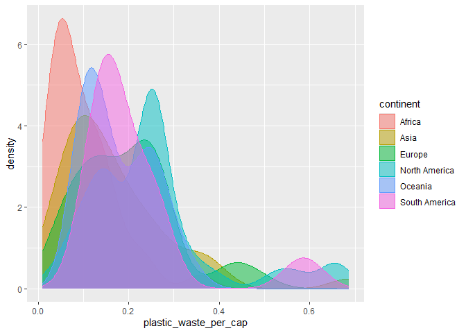
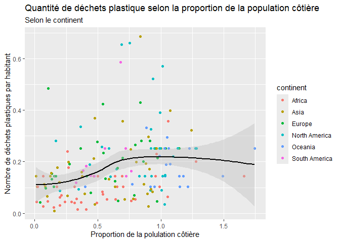

Lab 02 - Plastic waste
================
Lucas Antenucci
15 septembre 2025

## Chargement des packages et des données

``` r
library(tidyverse) 
```

``` r
plastic_waste <- read_csv("data/plastic-waste.csv")
 plastic_waste %>%
  filter(plastic_waste_per_cap< 3.5)
```

    ## # A tibble: 188 × 10
    ##    code  entity              continent    year gdp_per_cap plastic_waste_per_cap
    ##    <chr> <chr>               <chr>       <dbl>       <dbl>                 <dbl>
    ##  1 ALB   Albania             Europe       2010       9927.                 0.069
    ##  2 DZA   Algeria             Africa       2010      12871.                 0.144
    ##  3 AGO   Angola              Africa       2010       5898.                 0.062
    ##  4 AIA   Anguilla            North Amer…  2010         NA                  0.252
    ##  5 ATG   Antigua and Barbuda North Amer…  2010      19213.                 0.66 
    ##  6 ARG   Argentina           South Amer…  2010      18712.                 0.183
    ##  7 ABW   Aruba               North Amer…  2010         NA                  0.252
    ##  8 AUS   Australia           Oceania      2010      41464.                 0.112
    ##  9 BHS   Bahamas             North Amer…  2010      29222.                 0.39 
    ## 10 BHR   Bahrain             Asia         2010      40571.                 0.132
    ## # ℹ 178 more rows
    ## # ℹ 4 more variables: mismanaged_plastic_waste_per_cap <dbl>,
    ## #   mismanaged_plastic_waste <dbl>, coastal_pop <dbl>, total_pop <dbl>

Commençons par filtrer les données pour retirer le point représenté par
Trinité et Tobago (TTO) qui est un outlier.

``` r
 plastic_waste %>%
  filter(plastic_waste_per_cap< 3.5) 
```

    ## # A tibble: 188 × 10
    ##    code  entity              continent    year gdp_per_cap plastic_waste_per_cap
    ##    <chr> <chr>               <chr>       <dbl>       <dbl>                 <dbl>
    ##  1 ALB   Albania             Europe       2010       9927.                 0.069
    ##  2 DZA   Algeria             Africa       2010      12871.                 0.144
    ##  3 AGO   Angola              Africa       2010       5898.                 0.062
    ##  4 AIA   Anguilla            North Amer…  2010         NA                  0.252
    ##  5 ATG   Antigua and Barbuda North Amer…  2010      19213.                 0.66 
    ##  6 ARG   Argentina           South Amer…  2010      18712.                 0.183
    ##  7 ABW   Aruba               North Amer…  2010         NA                  0.252
    ##  8 AUS   Australia           Oceania      2010      41464.                 0.112
    ##  9 BHS   Bahamas             North Amer…  2010      29222.                 0.39 
    ## 10 BHR   Bahrain             Asia         2010      40571.                 0.132
    ## # ℹ 178 more rows
    ## # ℹ 4 more variables: mismanaged_plastic_waste_per_cap <dbl>,
    ## #   mismanaged_plastic_waste <dbl>, coastal_pop <dbl>, total_pop <dbl>

## Exercices

### Exercise 1

``` r
ggplot(data = plastic_waste%>%
filter(plastic_waste_per_cap < 3.5), aes(x = plastic_waste_per_cap)) + geom_histogram(binwidth = 0.2, binheight=5)+
facet_grid(~continent) +
  facet_wrap(~continent,ncol =3)
```

    ## Warning in geom_histogram(binwidth = 0.2, binheight = 5): Ignoring unknown
    ## parameters: `binheight`

<!-- -->

Les pays de l’Afrique, l’océanie et l’Asie font peu de déchet comparés à
ceux de l’Amérique du Nord, du Sud et l’Europe.

### Exercise 2

``` r
ggplot(data = plastic_waste%>%
filter(plastic_waste_per_cap < 3.5), aes(x = plastic_waste_per_cap, color=continent, fill =continent, )) + geom_density(alpha = 0.5)
```

<!-- -->

Les réglages color et fill sont dans aes parce qu’ils sont associés aux
variables tandis que alpha vient régler un paramètre du graphique.

### Exercise 3

Boxplot:

``` r
ggplot(data = plastic_waste%>%
filter(plastic_waste_per_cap < 3.5), aes(y = plastic_waste_per_cap, x=continent)) + 
  geom_boxplot()
```

<!-- -->

Violin plot:

``` r
ggplot(data = plastic_waste%>%
filter(plastic_waste_per_cap < 3.5), aes(y = plastic_waste_per_cap, x=continent)) + 
  geom_violin()
```

<!-- -->

On peut voir plus précisément la distribution de l’ordonnée.

### Exercise 4

``` r
ggplot(data = plastic_waste%>%
filter(plastic_waste_per_cap < 3.5), aes(x = plastic_waste_per_cap, y=mismanaged_plastic_waste_per_cap, color=continent)) + 
  geom_point()
```

<!-- -->

On peut qui gère bien ses déchets. L’Afrique gère mal ses déchets ( deux
variables proportionnelles), l’Europe gère bien ses déchets. On peut
maintenant voir un échelle de quels continents gèrent bien leurs
déchets.

### Exercise 5

``` r
ggplot(data = plastic_waste%>%
filter(plastic_waste_per_cap < 3.5), aes(y = total_pop,x=plastic_waste_per_cap, color=continent)) + 
  geom_point()
```

    ## Warning: Removed 10 rows containing missing values or values outside the scale range
    ## (`geom_point()`).

<!-- -->

``` r
ggplot(data = plastic_waste%>%
filter(plastic_waste_per_cap < 3.5), aes(y = coastal_pop,x=plastic_waste_per_cap, color=continent)) + 
  geom_point()
```

<!-- -->

Dans les zones cotières, il y a moins de déchets produient pour des
populations plus importantes.

## Conclusion

Recréez la visualisation:

``` r
  ggplot(data = plastic_waste%>%
  mutate(coastal_pop_prop = coastal_pop / total_pop) %>%
  filter(plastic_waste_per_cap < 3), aes(x = coastal_pop_prop,y=plastic_waste_per_cap, color=continent, )) + 
  geom_point() +
     geom_smooth(method="loess",
                 se= TRUE,
                 color="black",
                 fill="gray") +
    labs(x= "Proportion de la polulation côtière", y="Nombre de déchets plastiques par habitant",title= "Quantité de déchets plastique selon la proportion de la population côtière",subtitle = "Selon le continent", lengend="Continent" ) 
```

    ## `geom_smooth()` using formula = 'y ~ x'

    ## Warning: Removed 10 rows containing non-finite outside the scale range
    ## (`stat_smooth()`).

    ## Warning: Removed 10 rows containing missing values or values outside the scale range
    ## (`geom_point()`).

<!-- -->
